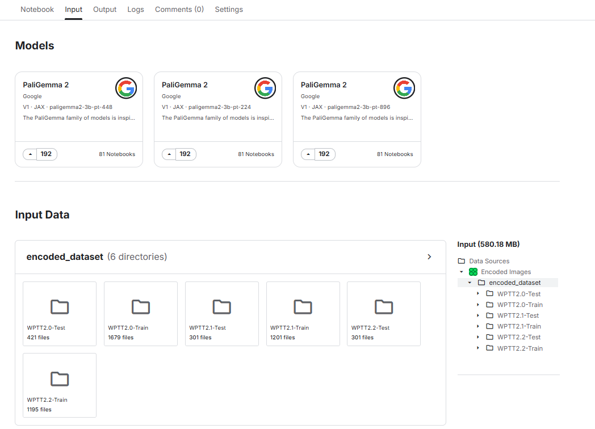
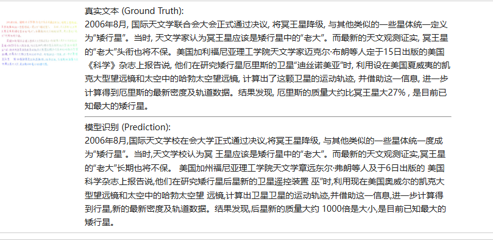
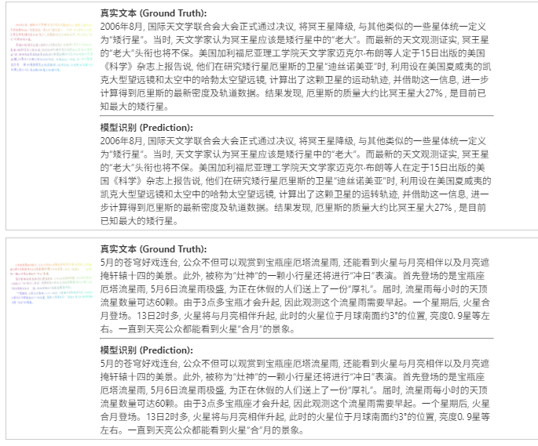

# 文件说明

## PaliGemmaDataset
（介于作业上传大小的限制数据集和从处理后的dataset没有包含到上传到作业版本的文件夹中）

用于预处理 **CASIA-OLHWDB2.0-2.2** 中的整页文本数据

PALIGEMMADATASET/
├── __pycache__/
├── data/
│   ├── WPTT2.0-Test/
│   ├── WPTT2.0-Train/
│   ├── WPTT2.1-Test/
│   ├── WPTT2.1-Train/
│   ├── WPTT2.2-Test/
│   └── WPTT2.2-Train/
├── batch_process.py
└── data.py

运行脚本：
````shell
python batch_process.py
````

运行结果：

PALIGEMMADATASET/
├── __pycache__/
├── data/
└── encoded_dataset/
    ├── WPTT2.0-Test/
    ├── WPTT2.0-Train/
    ├── WPTT2.1-Test/
    ├── WPTT2.1-Train/
    ├── WPTT2.2-Test/
    └── WPTT2.2-Train/
每个目录下生成`metadata.json`文件描述目录中所有图像与其对应的标签
例：

```json
{
    "501-P14.png": "“自然保护国际”组织4日报告说,\n一支考察队在南美国家苏里南的高原发现24个新物种,\n其中包括一种发荧光的紫色蛙。率领这支考察队的“自然保护国际”成员李安妮·阿隆索说,\n考察队2006年在苏里南的拿骚高原发现了这种蛙。它背部皮肤呈酱紫色,\n上面还不规则地分布淡紫色荧光圈。除了这种紫蛙,\n考察队还在拿骚高原和莱利山新发现了其余4种蛙、6种鱼、12种金龟子科甲虫和1种蚂蚁。阿隆索说,\n该组织前往些未勘察的偏远地区寻找新物种,\n但一般发现的都是昆虫,\n“这次我们发现这么多新的鱼类和蛙类,\n真是令人兴奋。”",
    "501-P15.png": "5月,\n是新疆天山草场返青、牛羊长膘之时。然而,\n在温泉县境内草原上,\n牧民们却为泛滥成灾的旱獭与鼠害犯愁。距离温泉县城30多公里的库克它乌草场,\n是兵团88团最优质的草场。但是这两年由于旱獭和草原黄鼠的逐年增多,\n库克它乌草场已成为受害最严重的草场。5月5日,\n笔者随同88团畜牧公司负责人,\n驱车进入库克它乌草场实地察看:\n一望无边的草原上,\n遍布着密密麻麻的旱獭洞及成片的黄沙;\n来回奔跑撕咬嬉闹的旱獭比兔子还大,\n它们挖的洞穴一个连一个,\n深不见底,\n大如脸盆。",
    "501-P16.png": "我国特有的“国宝”植物崖柏已被宣布消失了100多年,\n近日,\n在深圳国际文博会上,\n收藏家陈奕洪带着数件崖柏根雕亮相,\n让人们重新得以一睹崖柏的风采。据了解,\n崖柏生长于700米至2100米的山上,\n是世界“活化石”物种之一,\n生长速度极慢,\n一年才长0.\n01毫米,\n是稀有植物。1892年法国传教士在重庆市首次采集到崖柏标本。此后100多年,\n尽管人们多次找寻,\n不仅没发现活的植株,\n就连标本和文字也再没有新的记录。9年前,\n世界保护联盟(I\nU\nC\nN\n)将它列为已经灭绝的3种中国特有植物之一;\n1998年,\n作为中国特有植物之一,\n崖柏被世界自然保护联盟公布为世界受威胁植物记录,\n被宣告灭绝。",
    ......
}
```


## paligemma449px.ipynb

kaggle提供完整的paligemma2模型和权重，故选择在kaggle上微调paligemma

#### kaggle运行示例
  **1. 在kaggle上新建notebook**

  **2. 新建一个dataset将上一步骤生成的encoded_dataset文件夹上传到dataset**

  **3. 将创建好的 dataset 和 PaliGemma2 Input到新建的notebooke**

  **4. 根据notebook中所述运行**


**微调前后识别效果对比示例：**



---



